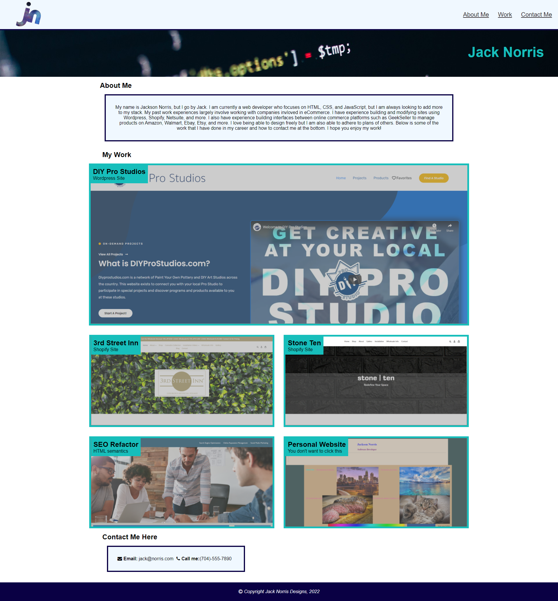

# My personal portfolio

link to live demo: [My personal portfolio](https://jacksonnorris.github.io/bc-advanced-css/)

## What it does

```

Demonstrates to visitors my personal portfolio
Includes a section about me, my work, and how to contact me
Navigation links lead to corresponding parts of the page
Page responds responsivelly to devices of different sizes
Page links to real projects created by me
Hovering over images lowers the opacity

```

## How it Looks

The following image shows how the page currently looks


